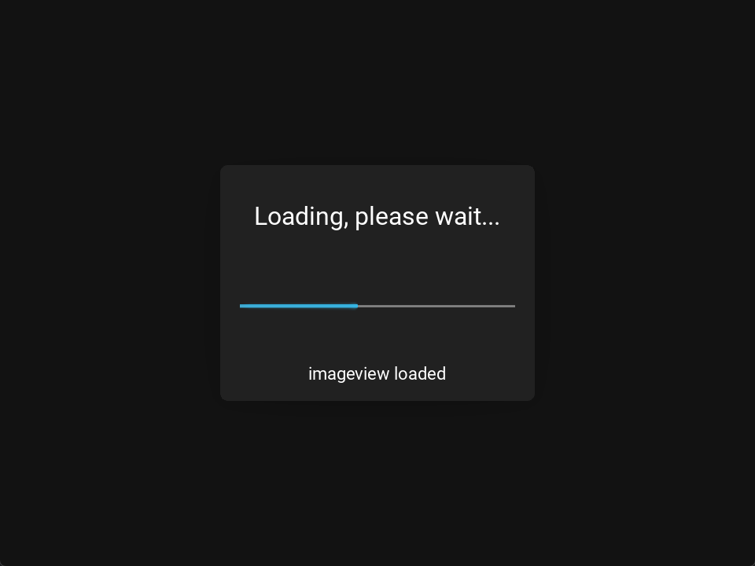
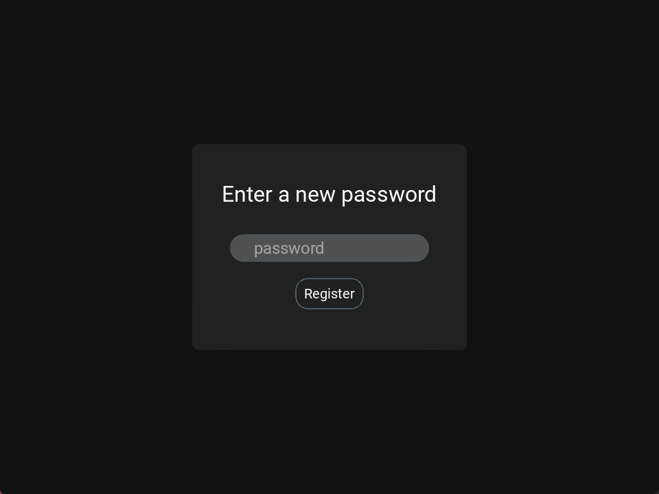
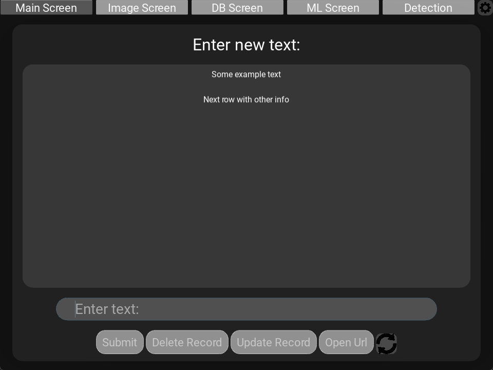
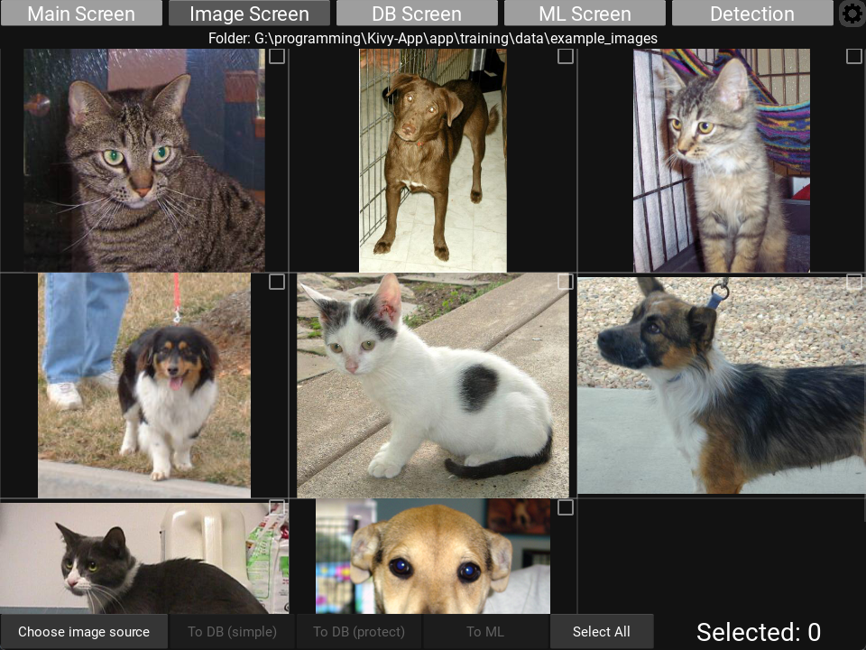
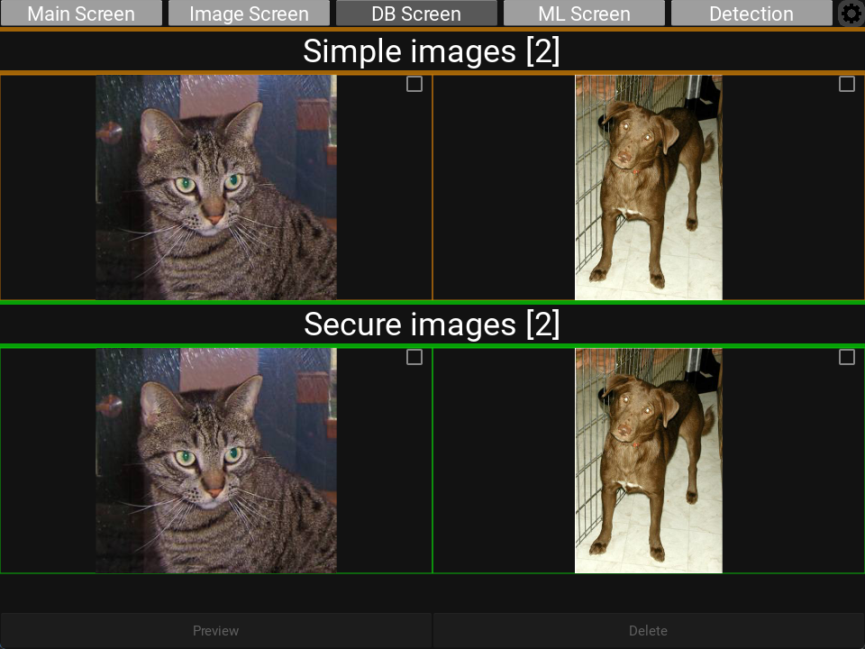
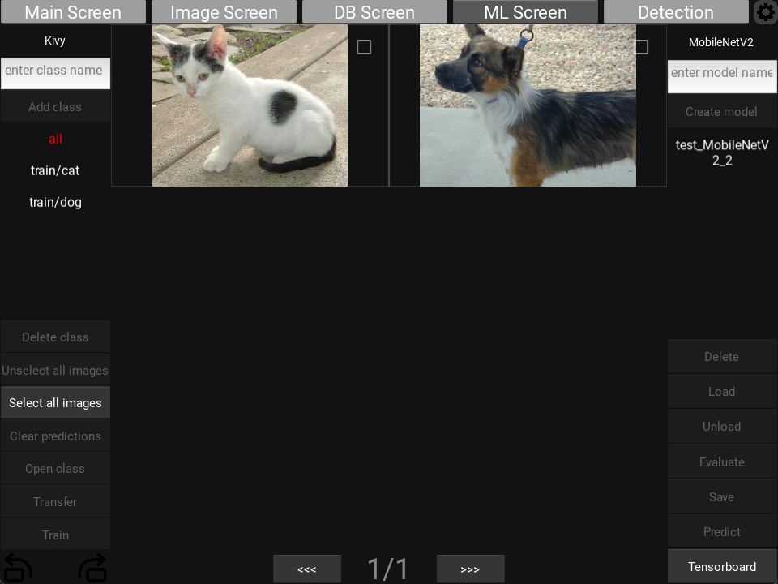
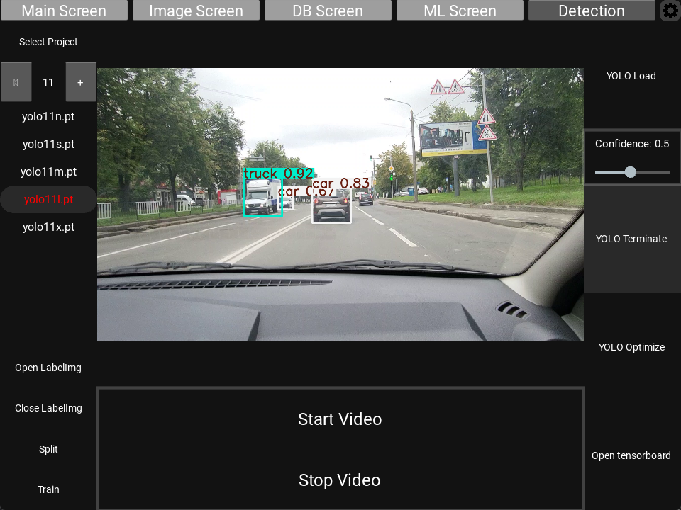
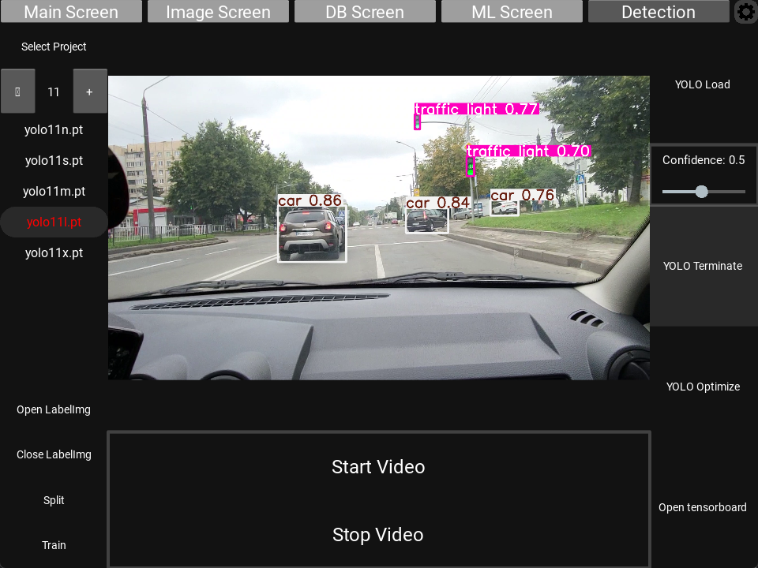
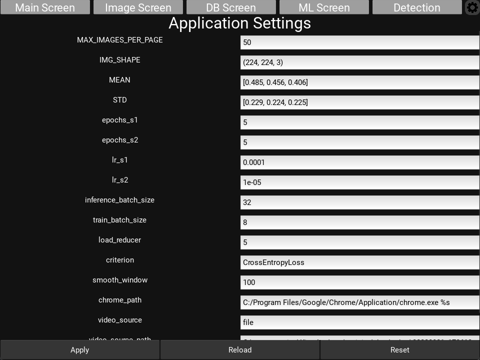

# Python Kivy ML App

A modular Kivy/KivyMD desktop app that combines secure local storage, image workflows, and ML tooling
(classification + detection) in one UI.

[Report Bug](https://github.com/KaMeLoTmArMoT/Kivy-App/issues) · [Request Feature](https://github.com/KaMeLoTmArMoT/Kivy-App/issues)

[](https://github.com/KaMeLoTmArMoT/Kivy-App/actions/workflows/tests-minimal.yml)
[](https://github.com/KaMeLoTmArMoT/Kivy-App/actions/workflows/pre-commit.yml)

## About the project
This application is designed as a “real app” playground: multiple screens, persistent data, and repeatable workflows
around images and ML projects, while keeping the codebase modular enough to evolve over time.

It includes common UI flows (navigation, CRUD-like interactions, image browsing) plus ML-focused flows such as project
selection, dataset preparation, training runs, and evaluation/detection.

<p align="center">
  
</p>

<table>
  <tr>
    <td></td>
    <td></td>
    <td></td>
  </tr>
  <tr>
    <td></td>
    <td></td>
    <td></td>
  </tr>
  <tr>
    <td></td>
    <td></td>
    <td></td>
  </tr>
</table>

## Key features
- Security: password hashing/verification and encryption utilities for app data.
- Image workflows: browsing, selection, pagination/lazy loading, and dataset-related operations.
- ML tooling: classification training pipelines and YOLO-based detection workflows.
- Projects: project-oriented folder structure under `app/training/` to keep datasets/configs/models grouped.
- Testing: Kivy-aware pytest fixtures with focused unit coverage and integration tests for navigation/auth/CRUD/images/DB/ML flows.

## Getting started

### Install
```bash
uv sync
```

### Run
```bash
uv run python main.py
```

### Linting & Formatting
```bash
uv run ruff check --fix
uv run ruff format
```

### Tests
Integration tests live under `app/tests/` and include a guide at `app/tests/README_TESTS.md`.

Quick run:
```powershell
uv run pytest --timeout 30 -m fast -q
uv run pytest --timeout 30 -m slow -q
```

## Project layout (current)
```text
app/
  screens/
    services/     # Auth, classification, camera, detection/ML workspace, export, and YOLO services
    view/         # View controllers for screens (db_screen, ml_screen, detection_screen, etc.)
    utils/        # DB, navigation, widgets, project/image loading, logging, and compatibility helpers
  ui/             # .kv files (Kivy declarative layouts)
  resources/      # Assets (icons/images)
  training/       # ML projects/datasets/models
  tests/          # pytest fixtures, unit tests, and integration tests
```

## Roadmap
- Step 1 refactoring: service extraction and fast/slow CI split complete.
- Step 2: Python / Kivy 2.3.1 runtime upgrade and compatibility validation complete.
- Step 3: migrate the UI layer to KivyMD 2.0.0 / MD3 (next).
- Improve multi-project UX and config portability (import/export).
- Packaging/deployment helpers (build scripts, Docker).
- Expand ML evaluation utilities and make more parameters configurable.

## License

This project is licensed under the MIT License — see [`LICENSE`](https://github.com/KaMeLoTmArMoT/Kivy-App/blob/master/LICENSE).

## Acknowledgments

- README structure inspired by Best-README-Template.
- Built with assistance from generative AI tools for ideation and code suggestions; all changes were reviewed and tested by the author.
